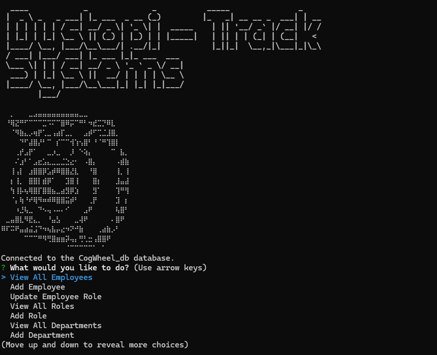
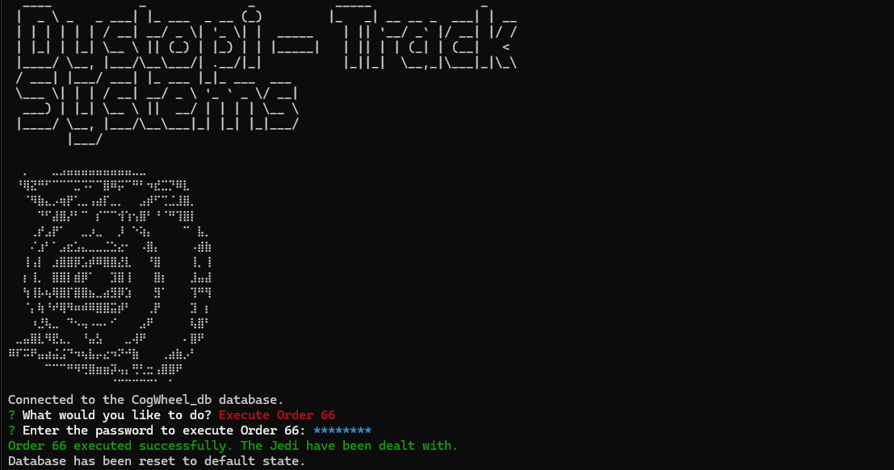

# Dystopi-Track Systems

## Description
DystopiTrack Systems is a command-line interface (CLI) application designed to manage employee data within corporate environment. The application offers a rich set of features allowing administrators to handle various aspects of employee, department, and role management efficiently, directly from the terminal.

## Table of Contents
- [Installation](#installation)
- [Usage](#usage)
- [Screenshot](#screenshot)
- [Video](#video)
- [Technologies](#technologies)
- [License](#license)
- [Contributing](#contributing)
- [Questions](#questions)

## Installation
To get started with DystopiTrack Systems, clone the repository and install the necessary dependencies via NPM:

git clone https://github.com/AaronBringhurst/Dystopi-Track-software
cd DystopiTrack
npm install

Ensure that PostgreSQL is installed and properly configured on your system. Update the database connection settings in the pool.js file under the db directory according to your PostgreSQL configuration.

To run the application, execute:

node index.js

Follow the on-screen prompts to manage employee data.

## Usage
The main menu provides the following options, which you can navigate using the arrow keys and select with the Enter key:

- View All Employees: Displays a table listing all employees, including their IDs, names, roles, departments, and salaries.

- Add Employee: Prompts you to enter the first name, last name, role, and manager for a new employee and adds them to the database.

- Update Employee Role: Allows you to select an employee and assign them a new role.

- View All Roles: Shows all available roles in the organization along with their details such as ID, title, and salary.

- Add Role: Enables you to create a new role by specifying the role title, salary, and department.

- View All Departments: Lists all departments in the organization.

- Add Department: Allows you to create a new department by entering the department name.

- Execute Order 66: A special feature that requires a password to execute. Upon correct password entry, a predefined action will be executed.

- Exit: Closes the application.

### Performing Tasks ###

After selecting an option from the menu:

1. View Actions: For viewing employees, roles, or departments, the application will directly display the requested data in a formatted table.

2. Add Actions: When adding a new employee, role, or department, you'll be prompted to enter the necessary information through a series of questions. After providing the required data, confirm the submission, and the information will be added to the database.

3. Update Actions: If you choose to update an employee's role, you'll first select the employee from a list and then the new role from another list. Confirm your selection to update the database.

### Exiting the Application ###

To exit the application, select the Exit option from the main menu. The application will terminate, and you'll be returned to the command line.

## Screenshot

*Figure 1: The main menu of DystopiTrack Systems showing the various options available to manage employees, departments, and roles. This menu is navigated using the arrow keys with selections made by pressing the Enter key.*

*Figure 66: Screenshot of the 'Execute Order 66' command being executed in DystopiTrack Systems. The user is prompted to enter a password, 'itsatrap', to initiate a database cleanup. Upon successful entry, the system confirms that "The Jedi have been dealt with," humorously indicating that the database has been reset to its default state.*

## Video

## Technologies

This project utilizes the following technologies:

- **[Node.js](https://nodejs.org/)**: A JavaScript runtime built on Chrome's V8 JavaScript engine. Node.js is used as the primary platform for running the application, enabling efficient server-side scripting and event-driven, non-blocking I/O operations.

- **[Inquirer.js](https://www.npmjs.com/package/inquirer)**: A library for creating interactive command-line user interfaces. It simplifies collecting user input, making the CLI more user-friendly and intuitive.

- **[PostgreSQL](https://www.postgresql.org/)**: An open-source object-relational database system that provides reliability, robustness, and performance. PostgreSQL is employed to manage all data concerning employees, roles, and departments.

- **[pg (node-postgres)](https://node-postgres.com/)**: This is a collection of Node.js modules for interfacing with your PostgreSQL database. It allows for querying and connecting to your PostgreSQL instance directly from the Node.js application.

- **[Colors.js](https://www.npmjs.com/package/colors)**: A library to add color and style to the Node.js console. It enhances the visual appeal of the CLI output, making information easier to read and engage with.

- **[Figlet](http://www.figlet.org/)**: Used for generating ASCII art from text. In this application, Figlet is utilized to display the application's name in a stylized text format upon startup, adding a distinctive, eye-catching element to the interface.

Each technology was selected for its specific contribution to the project’s functionality, enhancing the overall performance and user experience.

## License
This project is licensed under the ## License
This project is licensed under the [MIT License](https://opensource.org/licenses/MIT).

 license.

## Contributing
for contrubitions please email me [bringhurst.aaron@gmail.com](mailto:bringhurst.aaron@gmail.com)

## Questions
If you have any questions about the project, feel free to reach out!

- **Email**: [bringhurst.aaron@gmail.com](mailto:bringhurst.aaron@gmail.com)
- **GitHub**: [AaronBringhurst](https://github.com/AaronBringhurst)

